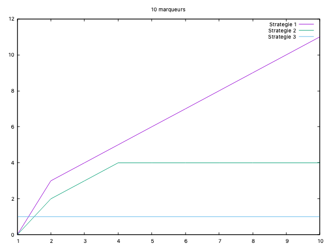
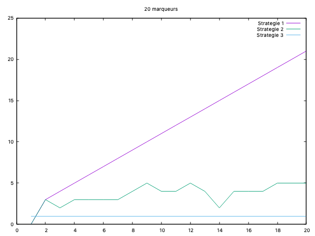
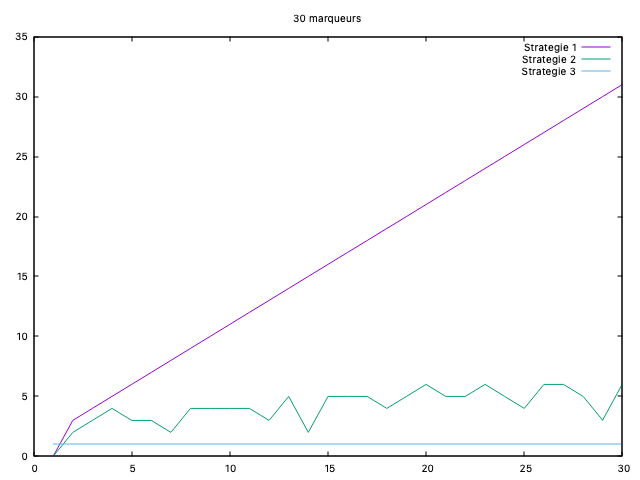
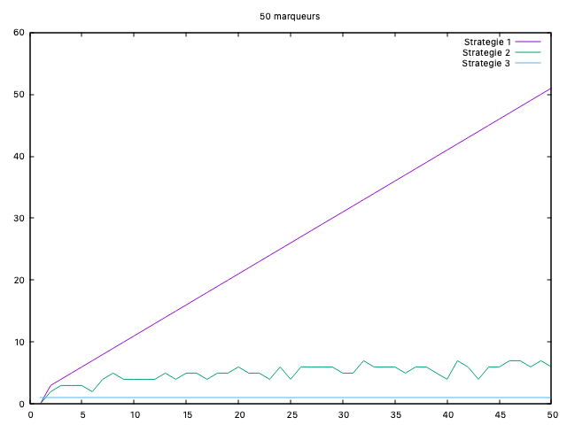
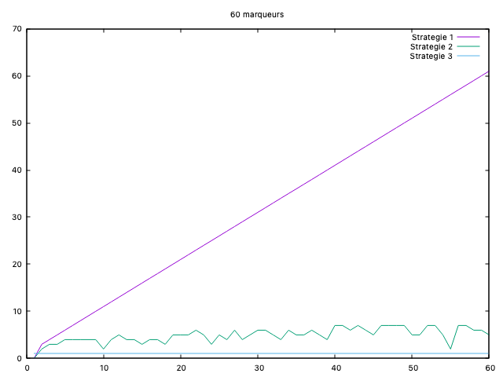
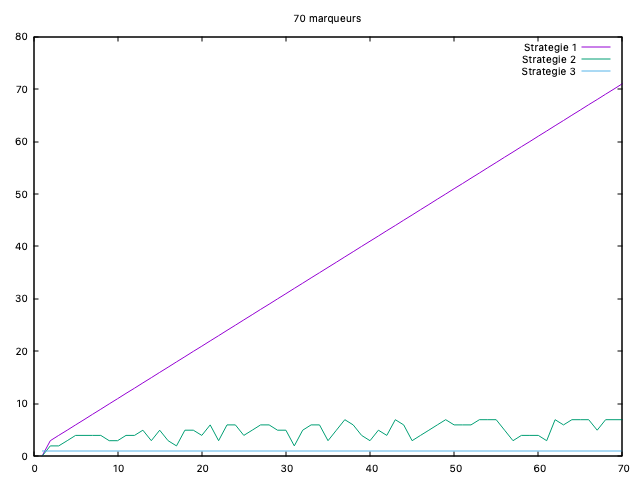
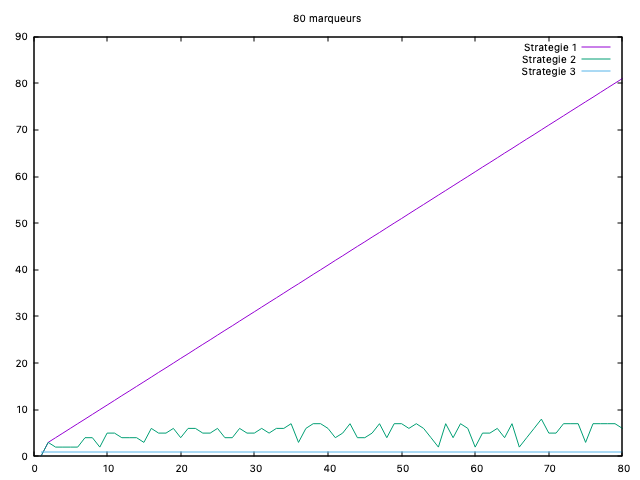
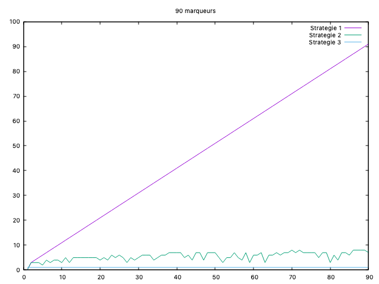
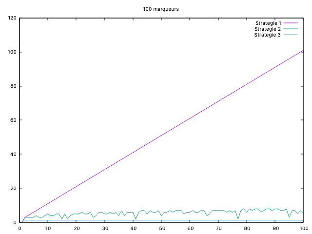

# Tp Expérimentations

## État du TP

Décrivez ici l'état d'avancement du TP.
Première séance du Tp: 1.1.b
Premier travaille après séance Tp: Recherche empirique des cas favorables.1

## Réponses aux questions

Indiquez ici les réponses aux questions posées dans le TP. Vous
reprendrez le numéro de la section et le numéro de la question. Par
exemple pour répondre à la question 3 de la section 2.4 vous indiquerez :

### Question 1.1.a
Je propose de compter le nombre de comparaison.

### Question 1.1.b
Oui il existe un pire des cas.
Le pire de cas est quand le marker ne sera pas  dans la liste des elements positives ce qui obligera notre programme de parcourir toutes la liste positive à chaque element du marker.

### Question 1.1.c
La fonction compare a pour complexité: 2

"if trouve==False:" a pour complexité: m
"if compare(markers[i],positive[j])==0:" a pour complexité: 3 * p * m (dont 3=2 (de compare) +1 (de ==0))
"while i<len(markers)-1 and trouve==False: " a pour complexité: 2*m(2=1(i<len(markers)-1)+1(trouve==False))

Donc au total C1(m,p)=3pm + 2m + m = 3pm + 3m = 3m(p+1)

### Question 2.2
Oui il existe un pire des cas.
Le pire de cas est quand le marker ne sera pas  dans la liste des elements positives ce qui obligera notre programme de faire une recherche complète dans la liste qu'on a triée positive

La borne supérieure du nombre d'opérations c2(m,p) en fonction de m et p est:

"if trouve==False:" a pour complexité: m
"elif compare(element_milieu,i)==-1:"/"if compare(element_milieu,markers[i])==0:" a pour compléxité: 6*log(p)
"while debut<=fin and trouve==False:" a pour compléxité : 2*log(p)
"while i<len(markers)-1 and trouve==False:" a pour complexité: 2*m

Donc au total C2(m,p)=2m+6 *log(p) +2 *log(p) +m=3m+8log(p)

### Question 3.2
Oui il existe un pire des cas.
Le pire de cas est quand les markers ne seront pas  dans la liste des elements positives ce qui obligera notre programme de faire parcourir toutes notre liste ensemble

La borne supérieure du nombre d'opérations pour la stratégie 3 est  5*e opérations parce qu'on a qu'une seule boucle while qui parcourera notre liste ensemble qui contient les élements de m et les élements de p et qui a donc m+p elements 

"if compare(ensemble[i],ensemble[i+1])==0:" a pour complexité: 3*e
"while i<len(ensemble) and trouve==False:" a pour complexité : 2*e

Donc C3(m,p)=3 *e +2 *e= 5 * e (avec e=m+p)

## Les graphes:

